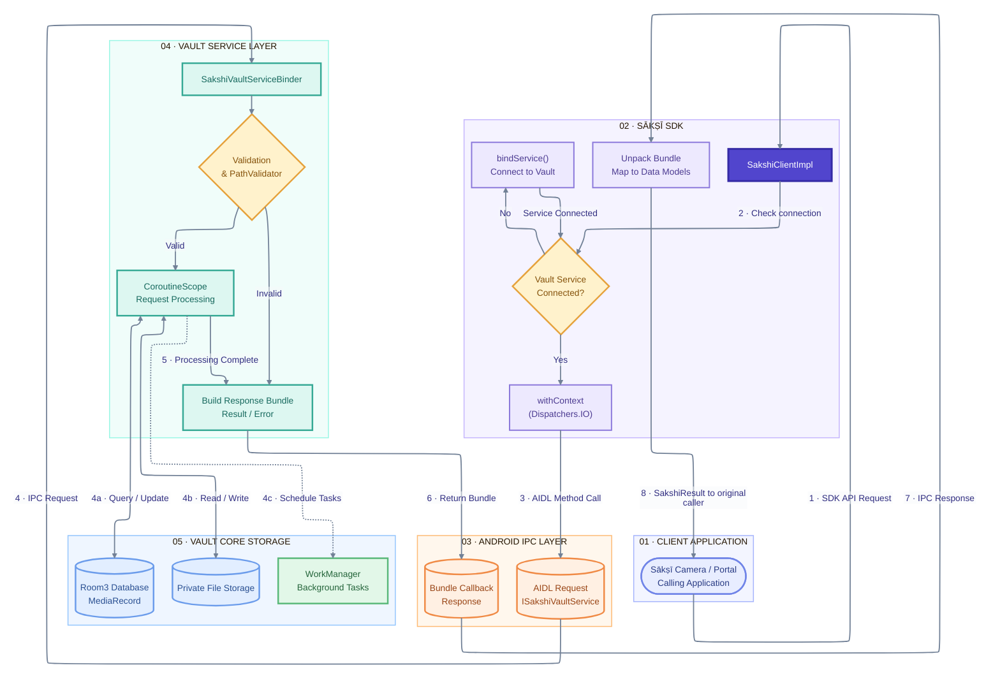

```mermaid
---
config:
  layout: elk
  theme: base
  look: classic
  themeVariables:
    background: "#FFFFFF"
    primaryColor: "#EEF2FF"
    primaryTextColor: "#312E81"
    primaryBorderColor: "#818CF8"
    secondaryColor: "#CCFBF1"
    secondaryTextColor: "#134E4A"
    tertiaryColor: "#DBEAFE"
    lineColor: "#718096"
    textColor: "#1E293B"
    edgeLabelBackground: "#F8FAFC"
    clusterBkg: "#F8FAFC"
    clusterBorder: "#CBD5E1"
    nodeTextColor: "#1E293B"
    fontSize: "14px"
    fontFamily: "Inter, Arial, sans-serif"
  flowchart:
    nodeSpacing: 42
    rankSpacing: 62
    diagramPadding: 22
    curve: basis
    htmlLabels: false
    inheritDir: true
---
flowchart TD

    %% 01 · CLIENT APPLICATION
    subgraph ClientLayer["01 · CLIENT APPLICATION"]
        direction TB
        ClientApp(["Sākṣī Camera / Portal<br/>Calling Application"])
    end

    %% 02 · SĀKṢĪ SDK
    subgraph SDKLayer["02 · SĀKṢĪ SDK"]
        direction TB
        SakshiClient["SakshiClientImpl"]
        CheckConn{"Vault Service<br/>Connected?"}
        BindService["bindService()<br/>Connect to Vault"]
        DispatchIO["withContext<br/>(Dispatchers.IO)"]
        Unpack["Unpack Bundle<br/>Map to Data Models"]
    end

    %% 03 · ANDROID IPC
    subgraph OS["03 · ANDROID IPC LAYER"]
        direction TB
        BinderReq[("AIDL Request<br/>ISakshiVaultService")]
        BinderRes[("Bundle Callback<br/>Response")]
    end

    %% 04 · VAULT SERVICE
    subgraph VaultLayer["04 · VAULT SERVICE LAYER"]
        direction TB
        VaultBinder["SakshiVaultServiceBinder"]
        Validate{"Validation<br/>& PathValidator"}
        Processing["CoroutineScope<br/>Request Processing"]
        PackBundle["Build Response Bundle<br/>Result / Error"]
    end

    %% 05 · VAULT CORE STORAGE
    subgraph StorageLayer["05 · VAULT CORE STORAGE"]
        direction TB
        DB[("Room3 Database<br/>MediaRecord")]
        FileStore[("Private File Storage")]
        WorkManager["WorkManager<br/>Background Tasks"]
    end

    %% REQUEST FLOW
    ClientApp -->|"1 · SDK API Request"| SakshiClient
    SakshiClient -->|"2 · Check connection"| CheckConn

    CheckConn -->|"No"| BindService
    BindService -->|"Service Connected"| CheckConn
    CheckConn -->|"Yes"| DispatchIO

    DispatchIO -->|"3 · AIDL Method Call"| BinderReq
    BinderReq -->|"4 · IPC Request"| VaultBinder

    %% VAULT PROCESSING
    VaultBinder --> Validate
    Validate -->|"Valid"| Processing
    Validate -->|"Invalid"| PackBundle

    Processing <-->|"4a · Query / Update"| DB
    Processing <-->|"4b · Read / Write"| FileStore
    Processing -.->|"4c · Schedule Tasks"| WorkManager
    Processing -->|"5 · Processing Complete"| PackBundle

    %% RESPONSE FLOW
    PackBundle -->|"6 · Return Bundle"| BinderRes
    BinderRes -->|"7 · IPC Response"| Unpack
    Unpack -->|"8 · SakshiResult to original caller"| ClientApp

    %% NODE PALETTE
    classDef client fill:#E8EDFF,stroke:#7185E8,stroke-width:2.5px,color:#293B83
    classDef sdk fill:#EDE9FE,stroke:#8B78DB,stroke-width:2px,color:#4C3B91
    classDef sdkCore fill:#5145CD,stroke:#352AA5,stroke-width:3px,color:#FFFFFF
    classDef decision fill:#FFF2CC,stroke:#E6A23C,stroke-width:2.5px,color:#85520B
    classDef os fill:#FFF0E3,stroke:#F08A45,stroke-width:2.5px,color:#994516
    classDef vault fill:#DDF7F1,stroke:#36A995,stroke-width:2.5px,color:#17695E
    classDef storage fill:#E2EEFF,stroke:#6B9CEB,stroke-width:2.5px,color:#294F91
    classDef background fill:#E2F7E8,stroke:#59B879,stroke-width:2.5px,color:#24643A

    class ClientApp client
    class SakshiClient sdkCore
    class BindService,DispatchIO,Unpack sdk
    class CheckConn,Validate decision
    class BinderReq,BinderRes os
    class VaultBinder,Processing,PackBundle vault
    class DB,FileStore storage
    class WorkManager background

    %% SOFT, COORDINATED LAYER BACKGROUNDS
    style ClientLayer fill:#F3F5FF,stroke:#A5B4FC,stroke-width:1.5px,color:#3730A3
    style SDKLayer fill:#F5F3FF,stroke:#C4B5FD,stroke-width:1.5px,color:#5B21B6
    style OS fill:#FFF7ED,stroke:#FDBA74,stroke-width:1.5px,color:#9A3412
    style VaultLayer fill:#F0FDFA,stroke:#99F6E4,stroke-width:1.5px,color:#115E59
    style StorageLayer fill:#EFF6FF,stroke:#93C5FD,stroke-width:1.5px,color:#1E40AF

    linkStyle default stroke:#718096,stroke-width:1.8px,color:#334155
```
