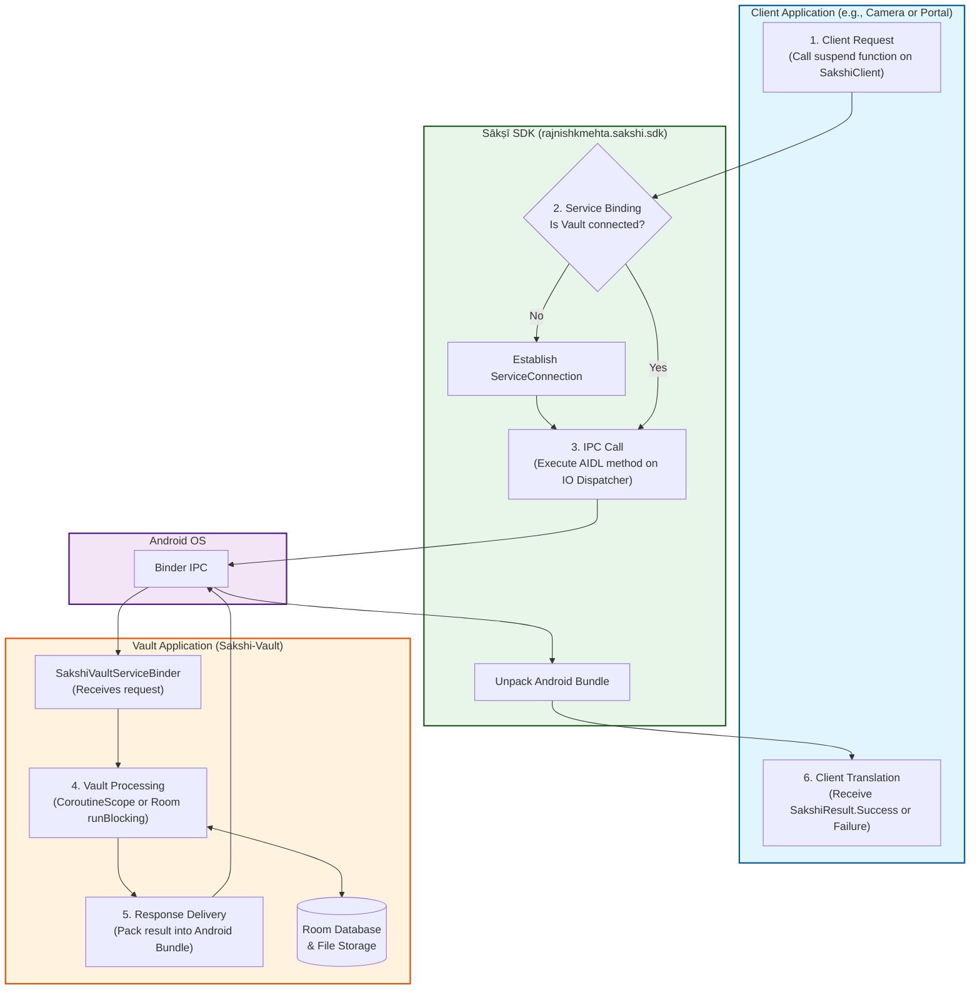

# Architecture Flow

This flowchart illustrates the detailed sequence of interactions between client applications, the Sākṣī SDK, and the Vault service during a typical operation.

```mermaid
flowchart TD
    %% Define components
    subgraph ClientApp["Client Application (e.g., Camera or Portal)"]
        Request["1. Client Request\n(Call suspend function on SakshiClient)"]
        Result["6. Client Translation\n(Receive SakshiResult.Success or Failure)"]
    end

    subgraph SakshiSDK["Sākṣī SDK (rajnishkmehta.sakshi.sdk)"]
        Binding{"2. Service Binding\nIs Vault connected?"}
        Bind["Establish ServiceConnection"]
        Dispatch["3. IPC Call\n(Execute AIDL method on IO Dispatcher)"]
        Unpack["Unpack Android Bundle"]
    end

    subgraph AndroidOS["Android OS"]
        IPC["Binder IPC"]
    end

    subgraph VaultApp["Vault Application (Sakshi-Vault)"]
        Binder["SakshiVaultServiceBinder\n(Receives request)"]
        Process["4. Vault Processing\n(CoroutineScope or Room runBlocking)"]
        Pack["5. Response Delivery\n(Pack result into Android Bundle)"]
        Storage[("Room Database\n& File Storage")]
    end

    %% Define flow
    Request --> Binding
    Binding -- No --> Bind --> Dispatch
    Binding -- Yes --> Dispatch

    Dispatch --> IPC
    IPC --> Binder

    Binder --> Process
    Process <--> Storage
    Process --> Pack

    Pack --> IPC
    IPC --> Unpack

    Unpack --> Result

    %% Styling
    classDef client fill:#e1f5fe,stroke:#01579b,stroke-width:2px;
    classDef sdk fill:#e8f5e9,stroke:#1b5e20,stroke-width:2px;
    classDef vault fill:#fff3e0,stroke:#e65100,stroke-width:2px;
    classDef os fill:#f3e5f5,stroke:#4a148c,stroke-width:2px;

    class ClientApp client;
    class SakshiSDK sdk;
    class VaultApp vault;
    class AndroidOS os;
```
